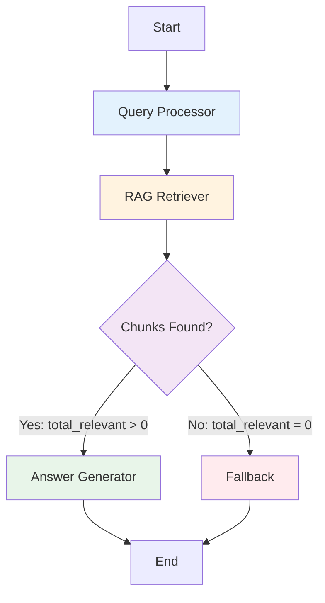

# LangGraph RAG Chatbot Architecture

Visual documentation of the multi-agent workflow.

## High-Level Architecture

```
┌─────────────────────────────────────────────────────────────────────┐
│                         USER QUESTION                               │
│                    "What causes OOM errors?"                        │
└───────────────────────────────┬─────────────────────────────────────┘
                                │
                                ▼
┌─────────────────────────────────────────────────────────────────────┐
│                      LANGGRAPH WORKFLOW                             │
│                                                                     │
│  ┌───────────────────────────────────────────────────────────┐    │
│  │  AGENT 1: Query Processor                                 │    │
│  │  ─────────────────────────────────────────────────────    │    │
│  │  Input:  "What causes OOM errors?"                        │    │
│  │  Action: Clean & normalize query                          │    │
│  │  Action: Generate embedding (1536 dims)                   │    │
│  │  Output: Embedding vector [0.123, -0.456, ...]           │    │
│  └────────────────────────┬──────────────────────────────────┘    │
│                           │                                        │
│                           ▼                                        │
│  ┌───────────────────────────────────────────────────────────┐    │
│  │  AGENT 2: RAG Retriever                                   │    │
│  │  ───────────────────────────────────────────────────────  │    │
│  │  Input:  Query embedding                                  │    │
│  │  Action: Search Weaviate vector DB                        │    │
│  │  Config: TOP_K_CHUNKS = 3                                 │    │
│  │  Config: DISTANCE_THRESHOLD = 0.7                         │    │
│  │  Output: Retrieved chunks with distances                  │    │
│  │                                                            │    │
│  │  Example Results:                                         │    │
│  │    Chunk 1: distance=0.23 ✅ (< 0.7 threshold)           │    │
│  │    Chunk 2: distance=0.35 ✅                              │    │
│  │    Chunk 3: distance=0.51 ✅                              │    │
│  └────────────────────────┬──────────────────────────────────┘    │
│                           │                                        │
│                           ▼                                        │
│  ┌───────────────────────────────────────────────────────────┐    │
│  │  DECISION NODE: Chunks Found?                             │    │
│  │  ──────────────────────────────────────────────────────   │    │
│  │  Condition: total_relevant > 0                            │    │
│  └────────────┬────────────────────────┬─────────────────────┘    │
│               │                        │                          │
│         YES   │                        │  NO                      │
│               ▼                        ▼                          │
│  ┌──────────────────────┐   ┌────────────────────────────┐       │
│  │ AGENT 3:             │   │ FALLBACK NODE              │       │
│  │ Answer Generator     │   │ ──────────────────────     │       │
│  │ ──────────────────   │   │ Return:                    │       │
│  │ Input:  Question +   │   │ "I couldn't find specific  │       │
│  │         Chunks       │   │  information about that    │       │
│  │ Config: LLM_MODEL    │   │  in the knowledge base..." │       │
│  │ Config: TEMPERATURE  │   │                            │       │
│  │ Action: Generate     │   │ Confidence: 0.2 (Low)      │       │
│  │         with GPT-4o  │   │ Fallback: True             │       │
│  │ Output: Answer +     │   └────────────┬───────────────┘       │
│  │         Sources      │                │                       │
│  │                      │                │                       │
│  │ Confidence: 0.8      │                │                       │
│  │ Fallback: False      │                │                       │
│  └──────────┬───────────┘                │                       │
│             │                            │                       │
│             └────────────┬───────────────┘                       │
│                          ▼                                       │
│                      ┌───────┐                                   │
│                      │  END  │                                   │
│                      └───────┘                                   │
└─────────────────────────────────────────────────────────────────┘
                                │
                                ▼
┌─────────────────────────────────────────────────────────────────────┐
│                     FINAL RESPONSE TO USER                          │
│                                                                     │
│  Answer: "OutOfMemoryError occurs when Docker containers..."       │
│  Sources: [jenkins-error-kb-001-outofmemory.md]                    │
│  Chunks Used: 3                                                    │
│  Tokens: 1,245                                                     │
│  Confidence: 80%                                                   │
│  Response Time: 2.3s                                               │
└─────────────────────────────────────────────────────────────────────┘
```

## Detailed Node Flow

### 1. Entry Point: Query Processor Node

**File**: `agents/query_processor.py`

```python
STATE IN:
{
    'user_question': "What causes OOM errors?",
    'processed_query': '',
    'query_embedding': [],
    ...
}

PROCESSING:
├─ Clean query: "What causes OOM errors?"
│  └─ Capitalize, add punctuation
│
├─ Generate embedding via OpenAI
│  └─ Model: text-embedding-3-small
│  └─ Dimensions: 1536
│
└─ Return embedding vector

STATE OUT:
{
    'user_question': "What causes OOM errors?",
    'processed_query': "What causes OOM errors?",
    'query_embedding': [0.123, -0.456, ...],  # 1536 floats
    ...
}
```

**Configuration Used**:
- `OPENAI_API_KEY` from `.env`
- `OPENAI_EMBEDDING_MODEL` from `.env`

---

### 2. RAG Retriever Node

**File**: `agents/rag_retriever.py`

```python
STATE IN:
{
    'query_embedding': [0.123, -0.456, ...],
    'retrieved_chunks': [],
    'total_relevant': 0,
    ...
}

PROCESSING:
├─ Connect to Weaviate
│  └─ Cluster: devops-db
│  └─ Collection: JenkinsKB
│
├─ Vector similarity search
│  └─ near_vector(query_embedding)
│  └─ limit = config.TOP_K_CHUNKS (3)
│  └─ return_metadata = ['distance']
│
├─ Filter by distance threshold
│  └─ Keep chunks where distance <= config.DISTANCE_THRESHOLD (0.7)
│
└─ Return relevant chunks

STATE OUT:
{
    'retrieved_chunks': [
        {
            'filename': 'jenkins-error-kb-001-outofmemory.md',
            'text': 'OutOfMemoryError occurs when...',
            'chunk_id': 'chunk_0',
            'distance': 0.23
        },
        {
            'filename': 'jenkins-error-kb-001-outofmemory.md',
            'text': 'To diagnose OOM errors...',
            'chunk_id': 'chunk_1',
            'distance': 0.35
        },
        {
            'filename': 'docker-troubleshooting.md',
            'text': 'Memory limits in Docker...',
            'chunk_id': 'chunk_0',
            'distance': 0.51
        }
    ],
    'total_relevant': 3,
    ...
}
```

**Configuration Used**:
- `TOP_K_CHUNKS = 3` from `config.py`
- `DISTANCE_THRESHOLD = 0.7` from `config.py`
- `WEAVIATE_URL` from `.env`
- `WEAVIATE_API_KEY` from `.env`
- `WEAVIATE_COLLECTION_NAME` from `.env`

---

### 3. Decision Function: Should Generate Answer?

**File**: `langgraph_chatbot.py` → `should_generate_answer()`

```python
DECISION LOGIC:
├─ Check: state['total_relevant'] > 0
│
├─ If TRUE (chunks found):
│  └─ Return "generate" → Route to Answer Generator
│
└─ If FALSE (no chunks):
   └─ Return "fallback" → Route to Fallback Node

EXAMPLE:
state['total_relevant'] = 3
→ Decision: "generate" ✅
→ Next node: answer_generator
```

---

### 4A. Answer Generator Node (Success Path)

**File**: `agents/answer_generator.py`

```python
STATE IN:
{
    'user_question': "What causes OOM errors?",
    'retrieved_chunks': [3 chunks],
    ...
}

PROCESSING:
├─ Build context from chunks
│  └─ Concatenate chunk texts with separators
│
├─ Create prompt
│  └─ System: "You are a helpful DevOps assistant..."
│  └─ Context: [3 chunks from KB]
│  └─ Question: "What causes OOM errors?"
│
├─ Call OpenAI Chat Completions
│  └─ Model: config.LLM_MODEL ("gpt-4o-mini")
│  └─ Temperature: config.TEMPERATURE (0.3)
│
├─ Extract sources
│  └─ Get unique filenames from chunks
│  └─ Calculate relevance: 1 - distance
│
└─ Return answer + metadata

STATE OUT:
{
    'final_answer': "OutOfMemoryError occurs when Docker containers...",
    'sources': [
        {
            'filename': 'jenkins-error-kb-001-outofmemory.md',
            'chunk_id': 'chunk_0',
            'relevance': 0.77  # (1 - 0.23)
        }
    ],
    'chunks_used': 3,
    'tokens_used': {
        'prompt': 523,
        'completion': 245,
        'total': 768
    },
    'is_fallback': False,
    'confidence_score': 0.8,
    ...
}
```

**Configuration Used**:
- `TEMPERATURE = 0.3` from `config.py`
- `LLM_MODEL = "gpt-4o-mini"` from `config.py`
- `OPENAI_API_KEY` from `.env`

---

### 4B. Fallback Node (No Chunks Path)

**File**: `langgraph_chatbot.py` → `fallback_node()`

```python
STATE IN:
{
    'user_question': "What is quantum computing?",
    'retrieved_chunks': [],
    'total_relevant': 0,
    ...
}

PROCESSING:
└─ Generate generic fallback response
   └─ No LLM call needed
   └─ Pre-written message

STATE OUT:
{
    'final_answer': "I couldn't find specific information about that...",
    'sources': [],
    'chunks_used': 0,
    'is_fallback': True,
    'confidence_score': 0.2,
    ...
}
```

---

## State Graph Structure



## Configuration Flow

```
┌─────────────────────────────────────────┐
│         config.py                       │
│  ─────────────────────────────────────  │
│  TOP_K_CHUNKS = 3                       │
│  DISTANCE_THRESHOLD = 0.7               │
│  TEMPERATURE = 0.3                      │
│  LLM_MODEL = "gpt-4o-mini"              │
│  DEBUG_MODE = False                     │
└────────────┬────────────────────────────┘
             │
             ├──────────────┬──────────────┬──────────────┐
             ▼              ▼              ▼              ▼
    ┌─────────────┐ ┌──────────────┐ ┌──────────────┐ ┌──────────────┐
    │ Query       │ │ RAG          │ │ Answer       │ │ Fallback     │
    │ Processor   │ │ Retriever    │ │ Generator    │ │ Node         │
    │             │ │              │ │              │ │              │
    │ Uses:       │ │ Uses:        │ │ Uses:        │ │ (No config)  │
    │ (None)      │ │ TOP_K_CHUNKS │ │ TEMPERATURE  │ │              │
    │             │ │ DISTANCE_    │ │ LLM_MODEL    │ │              │
    │             │ │ THRESHOLD    │ │              │ │              │
    └─────────────┘ └──────────────┘ └──────────────┘ └──────────────┘
```

## Example: Complete Execution Trace

### Scenario: User asks "What causes OutOfMemoryError?"

```
Step 1: Entry Point
───────────────────
user_question: "What causes OutOfMemoryError?"
→ Workflow starts with initial state

Step 2: Query Processor Node
─────────────────────────────
Input:  "What causes OutOfMemoryError?"
Action: Clean query → "What causes OutOfMemoryError?"
Action: Generate embedding → [1536 floats]
Output: processed_query, query_embedding
→ State updated, move to next node

Step 3: RAG Retriever Node
───────────────────────────
Input:  query_embedding
Action: Search Weaviate with near_vector()
Action: Retrieve TOP_K_CHUNKS (3)
Action: Filter by DISTANCE_THRESHOLD (0.7)
Result: Found 3 relevant chunks
Output: retrieved_chunks (3), total_relevant (3)
→ State updated, check decision

Step 4: Decision Function
──────────────────────────
Check:  total_relevant (3) > 0
Result: TRUE
Route:  "generate" → Answer Generator Node
→ Move to answer_generator

Step 5: Answer Generator Node
──────────────────────────────
Input:  user_question, retrieved_chunks (3)
Action: Build context from 3 chunks
Action: Create prompt with context
Action: Call OpenAI GPT-4o-mini
Action: TEMPERATURE = 0.3
Result: Generated answer (245 chars)
Output: final_answer, sources, tokens_used
        chunks_used (3), is_fallback (False)
        confidence_score (0.8)
→ State updated, move to END

Step 6: END
───────────
Final state returned to user
Response displayed in Streamlit UI
```

### Example Output to User:

```
╔═══════════════════════════════════════════════════════════╗
║  ANSWER                                                   ║
╠═══════════════════════════════════════════════════════════╣
║  OutOfMemoryError occurs when Docker containers exceed   ║
║  their allocated memory limits. Common causes include:   ║
║                                                           ║
║  1. Insufficient memory allocation in docker-compose.yml ║
║  2. Memory leaks in the application                      ║
║  3. Too many concurrent builds                           ║
║                                                           ║
║  To fix this, increase memory limits or optimize your    ║
║  Jenkins configuration.                                  ║
╚═══════════════════════════════════════════════════════════╝

📚 Sources:
  • jenkins-error-kb-001-outofmemory.md (Relevance: 77%)

🎯 Chunks: 3    🔢 Tokens: 768    📊 Confidence: 80%    ⏱️ Time: 2.3s
```

## How to Visualize

### Option 1: Generate Mermaid Diagram

```bash
cd C:\code\AI-DevOps-chatbot\kb-rag

# Activate venv
venv\Scripts\activate

# Run visualization script
python visualize_graph.py
```

This creates `langgraph_workflow_mermaid.txt` which you can paste into:
- https://mermaid.live/
- VS Code with Mermaid extension
- GitHub Markdown (renders automatically)

### Option 2: Generate PNG (Requires graphviz)

```bash
# Install graphviz first
# Windows: Download from https://graphviz.org/download/
# Or use Chocolatey: choco install graphviz

pip install pygraphviz

python visualize_graph.py
```

This creates `langgraph_workflow.png`

## Code Reference

### Main Files

| File | Purpose | Key Functions |
|------|---------|---------------|
| `langgraph_chatbot.py` | Orchestrator | `build_chatbot_graph()`, `RAGChatbot.ask()` |
| `agents/query_processor.py` | Agent 1 | `process_query()`, `_generate_embedding()` |
| `agents/rag_retriever.py` | Agent 2 | `retrieve()`, Weaviate search |
| `agents/answer_generator.py` | Agent 3 | `generate_answer()`, `generate_fallback()` |
| `config.py` | Settings | `TOP_K_CHUNKS`, `TEMPERATURE`, etc. |

### State Definition

```python
class ChatbotState(TypedDict):
    # Input
    user_question: str

    # Agent 1 outputs
    processed_query: str
    query_embedding: List[float]

    # Agent 2 outputs
    retrieved_chunks: List[Dict]
    total_relevant: int

    # Agent 3 outputs
    final_answer: str
    sources: List[Dict]
    chunks_used: int
    tokens_used: Dict

    # Metadata
    is_fallback: bool
    confidence_score: float
```

## Summary

This LangGraph workflow implements a **3-agent RAG system** with:

✅ **Agent 1**: Query processing and embedding generation
✅ **Agent 2**: Vector similarity search in Weaviate
✅ **Agent 3**: LLM answer generation with context
✅ **Decision Node**: Routes to answer generator or fallback
✅ **Fallback Node**: Handles cases with no relevant chunks
✅ **Configuration**: All settings in `config.py` (no UI controls)
✅ **State Management**: Clean state flow between nodes
✅ **Integration**: Embedded in Streamlit tab 5

**Next Steps**:
1. Run `python visualize_graph.py` to generate diagram
2. View Mermaid diagram at https://mermaid.live/
3. Test the workflow in Streamlit UI (Tab 5)
