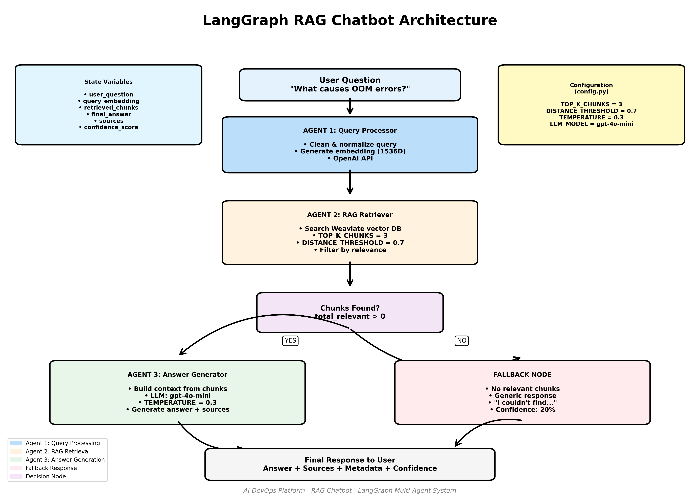

# LangGraph Visualization Guide

Complete guide to generating and viewing diagrams of the RAG chatbot architecture.

## Available Diagram Tools

We provide **two different visualization scripts**:

### 1. `visualize_graph.py` - Official LangGraph Diagrams
Generates diagrams directly from your LangGraph workflow code.

**Outputs**:
- `langgraph_workflow_mermaid.txt` - Mermaid diagram code
- `langgraph_workflow.png` - PNG image (via Mermaid.ink API)
- `langgraph_workflow.svg` - SVG image (via Mermaid.ink API)

**Pros**: Shows the actual graph structure as built by LangGraph
**Cons**: Requires internet connection for PNG/SVG generation

### 2. `draw_architecture.py` - Custom Professional Diagram
Generates a custom-designed diagram using matplotlib.

**Outputs**:
- `langgraph_architecture.png` - High-resolution PNG (300 DPI)
- `langgraph_architecture.pdf` - Vector PDF (scalable)

**Pros**: Professional appearance, shows configuration, fully offline
**Cons**: Manually designed (not auto-generated from code)

---

## Quick Start

### Method 1: LangGraph Official Diagram

```bash
cd C:\code\AI-DevOps-chatbot\kb-rag

# Activate venv
venv\Scripts\activate

# Run the visualization script
python visualize_graph.py
```

**Expected Output**:
```
Building LangGraph workflow...
Generating visualization...

✅ Mermaid diagram saved to: langgraph_workflow_mermaid.txt
   View at: https://mermaid.live/

Generating PNG image...
Fetching PNG from Mermaid.ink API...
✅ PNG diagram saved to: langgraph_workflow.png

Fetching SVG from Mermaid.ink API...
✅ SVG diagram saved to: langgraph_workflow.svg
```

**Files Created**:
- `langgraph_workflow_mermaid.txt` - Open at https://mermaid.live/
- `langgraph_workflow.png` - Open with any image viewer
- `langgraph_workflow.svg` - Open in browser or Inkscape

---

### Method 2: Custom Professional Diagram

```bash
cd C:\code\AI-DevOps-chatbot\kb-rag

# Activate venv
venv\Scripts\activate

# Install matplotlib (if not already)
pip install matplotlib

# Run the diagram generator
python draw_architecture.py
```

**Expected Output**:
```
============================================================
  LANGGRAPH ARCHITECTURE DIAGRAM GENERATOR
============================================================

✅ Architecture diagram saved to: langgraph_architecture.png
✅ PDF diagram saved to: langgraph_architecture.pdf

✅ Diagram generation complete!

Generated files:
  - langgraph_architecture.png (High-resolution image)
  - langgraph_architecture.pdf (Vector PDF)
```

**Files Created**:
- `langgraph_architecture.png` - 300 DPI, perfect for presentations
- `langgraph_architecture.pdf` - Vector format, infinite zoom

---

## Viewing the Diagrams

### PNG/SVG Files
```bash
# Windows
start langgraph_workflow.png
start langgraph_architecture.png

# Or drag-drop into browser
```

### Mermaid Text File
1. Open `langgraph_workflow_mermaid.txt`
2. Copy the content
3. Go to https://mermaid.live/
4. Paste into the editor
5. Interactive diagram appears instantly!

### PDF Files
```bash
# Windows
start langgraph_architecture.pdf

# Or open in Adobe Reader, browser, etc.
```

---

## Diagram Comparison

| Feature | `visualize_graph.py` | `draw_architecture.py` |
|---------|---------------------|----------------------|
| **Source** | Auto-generated from LangGraph code | Custom designed |
| **Accuracy** | 100% reflects actual code | Manually maintained |
| **Format** | Mermaid, PNG, SVG | PNG, PDF |
| **Quality** | Standard | Professional (300 DPI) |
| **Dependencies** | None (uses API) | matplotlib |
| **Internet** | Required for PNG/SVG | Not required |
| **Customization** | Limited | Full control |
| **Best For** | Verifying graph structure | Presentations, docs |

---

## Diagram Elements Explained

### visualize_graph.py Output

```
┌─────────────────────┐
│  __start__          │  ← Entry point
└──────────┬──────────┘
           ▼
┌─────────────────────┐
│  query_processor    │  ← Agent 1: Clean & embed
└──────────┬──────────┘
           ▼
┌─────────────────────┐
│  rag_retriever      │  ← Agent 2: Search Weaviate
└──────────┬──────────┘
           ▼
      ┌────────┐
      │ Decision │         ← Chunks found?
      └───┬──┬─┘
          │  │
    Yes   │  │  No
          ▼  ▼
    ┌─────┐ ┌──────┐
    │ AG  │ │ FB   │      ← Answer Generator / Fallback
    └──┬──┘ └───┬──┘
       │        │
       └────┬───┘
            ▼
      ┌─────────┐
      │ __end__ │          ← End
      └─────────┘
```

### draw_architecture.py Output

Shows:
- Color-coded nodes (Blue=Agent1, Orange=Agent2, Green=Agent3, Red=Fallback)
- Configuration box (config.py values)
- State variables box
- Decision logic with YES/NO paths
- Legend explaining colors
- Footer with metadata

---

## Customization

### Modify `draw_architecture.py`

#### Change Colors:
```python
# Line 25-31
color_agent1 = '#YOUR_COLOR'  # Hex color code
color_agent2 = '#YOUR_COLOR'
```

#### Change Box Sizes:
```python
# In draw_box() calls
draw_box(x, y, width, height, text, color, fontsize)
#              ↑      ↑       ↑
#           Adjust these
```

#### Add New Elements:
```python
# Add custom boxes
draw_box(8.5, 5.5, 2, 1, 'My Custom Box', '#FFCCCC', 9)

# Add arrows
draw_arrow(8.5, 5, 8.5, 4, 'Custom Arrow')
```

### Modify `visualize_graph.py`

#### Change Output Format:
```python
# To generate only Mermaid (skip PNG/SVG)
# Comment out lines 43-79 (PNG/SVG generation)
```

---

## Troubleshooting

### Error: "No module named 'matplotlib'"
```bash
pip install matplotlib
```

### Error: "PNG generation failed"
This is expected if you're offline. The script will still create:
- ✅ Mermaid text file (works offline)
- ❌ PNG/SVG (needs internet for API call)

**Solution**: Use `draw_architecture.py` instead (fully offline).

### Error: "Request failed with status 400"
The Mermaid diagram might be too complex for the API.

**Solution**: Use the Mermaid text file at https://mermaid.live/

### Diagram looks blurry
PNG diagrams are raster images and can look blurry when zoomed.

**Solutions**:
- Use `langgraph_architecture.pdf` (vector format, infinite zoom)
- Use `langgraph_workflow.svg` (vector format)
- Increase DPI in `draw_architecture.py`:
  ```python
  plt.savefig(output_file, dpi=600)  # Higher DPI
  ```

---

## Integration with Documentation

### Markdown Files
```markdown
# Architecture


```

### README.md
```markdown
## System Architecture

See our [LangGraph workflow diagram](langgraph_workflow.png)
```

### PowerPoint/Google Slides
1. Insert → Image
2. Select `langgraph_architecture.png`
3. Resize as needed (high DPI ensures quality)

### Confluence/Wiki
1. Upload `langgraph_architecture.pdf`
2. PDF renders perfectly in browsers

---

## Updating Diagrams

When you modify the LangGraph workflow:

```bash
# Re-generate official diagram (auto-updates)
python visualize_graph.py

# Update custom diagram (if you changed structure)
# Edit draw_architecture.py to match new flow
python draw_architecture.py
```

---

## Generated Files Summary

After running both scripts, you'll have:

```
kb-rag/
├── langgraph_workflow_mermaid.txt  ← Paste into mermaid.live
├── langgraph_workflow.png          ← Official LangGraph diagram
├── langgraph_workflow.svg          ← Official LangGraph (vector)
├── langgraph_architecture.png      ← Custom professional (raster)
└── langgraph_architecture.pdf      ← Custom professional (vector)
```

**Recommendation**:
- Use **`langgraph_architecture.pdf`** for presentations and docs (best quality)
- Use **`langgraph_workflow.png`** to verify code structure
- Use **Mermaid text** for interactive exploration at mermaid.live

---

## Example Workflow

### For Documentation:
```bash
# Generate professional diagram
python draw_architecture.py

# Copy PDF to docs folder
copy langgraph_architecture.pdf ..\docs\

# Update README
echo "See [architecture diagram](docs/langgraph_architecture.pdf)" >> README.md
```

### For Code Review:
```bash
# Generate official diagram to verify structure
python visualize_graph.py

# Open Mermaid in browser
start https://mermaid.live/

# Paste content from langgraph_workflow_mermaid.txt
# Share interactive link with team
```

### For Presentation:
```bash
# Generate high-res PNG
python draw_architecture.py

# Insert langgraph_architecture.png into PowerPoint
# Scales beautifully due to 300 DPI
```

---

## Advanced: Generate Both at Once

Create `generate_all_diagrams.py`:

```python
import subprocess
import os

print("Generating all diagrams...\n")

# Change to kb-rag directory
os.chdir(r"C:\code\AI-DevOps-chatbot\kb-rag")

# Run both scripts
scripts = [
    "visualize_graph.py",
    "draw_architecture.py"
]

for script in scripts:
    print(f"\nRunning {script}...")
    subprocess.run(["python", script])

print("\n" + "="*60)
print("✅ All diagrams generated successfully!")
print("="*60)
```

Run:
```bash
python generate_all_diagrams.py
```

---

## Summary

You now have **two powerful visualization tools**:

1. **`visualize_graph.py`** - Auto-generated from LangGraph code
   - Mermaid text → https://mermaid.live/
   - PNG/SVG via Mermaid.ink API

2. **`draw_architecture.py`** - Custom professional diagrams
   - High-res PNG (300 DPI)
   - Vector PDF (scalable)

**Quick Commands**:
```bash
# Generate official LangGraph diagram
python visualize_graph.py

# Generate professional custom diagram
python draw_architecture.py
```

**Files to Share**:
- `langgraph_architecture.pdf` - Best for docs/presentations
- `langgraph_workflow_mermaid.txt` - Best for interactive exploration

🚀 Your diagrams are ready!
